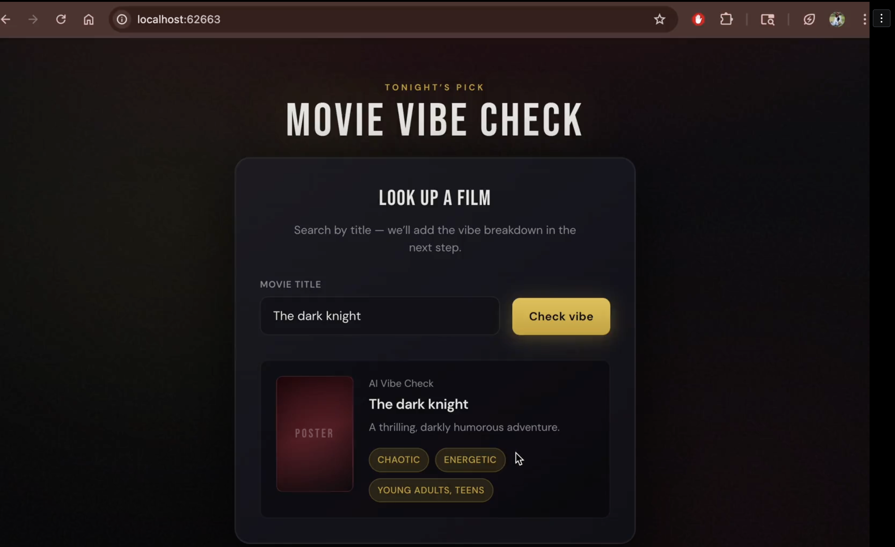
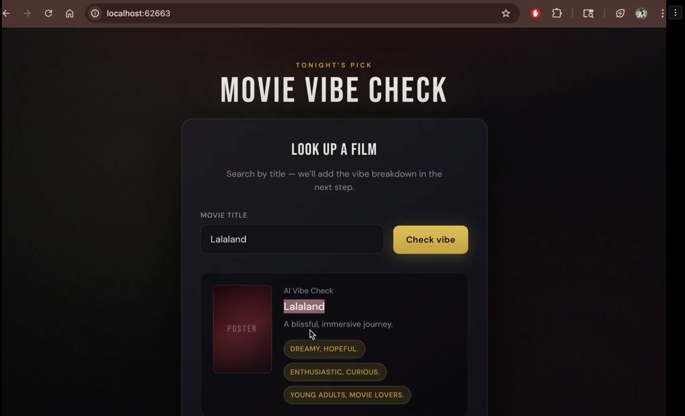
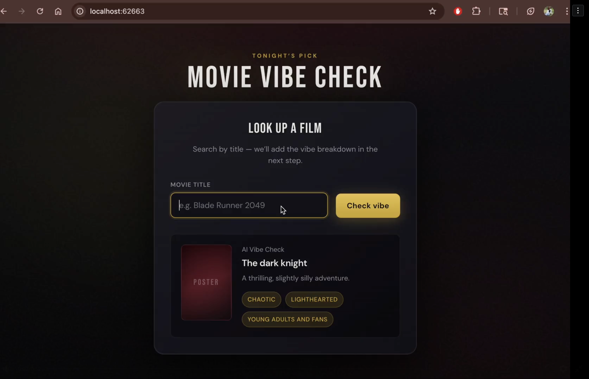

# 🎬 Movie Vibe Check

A lightweight AI-powered web app that gives you an instant "vibe check" for any movie title.

## What It Does

Type in any movie title, click **Check Vibe**, and the app uses a local AI model to return:
- 🎭 **Mood** — the emotional tone of the film
- 🎬 **Tone** — how the movie feels stylistically
- 👥 **Who It's For** — the ideal audience

Results appear instantly in the UI — no page reload, no waiting.

## Tech Stack

- HTML
- CSS
- Vanilla JavaScript (no frameworks)
- [Ollama](https://ollama.com/) running locally
- Model: `gemma3:1b`

## Screenshots

## Requirements

Before running the app make sure you have:
- Ollama installed on your machine
- Ollama running locally on `http://localhost:11434`
- The `gemma3:1b` model pulled and available

## Setup and Run

1. Open a terminal in this project folder
2. Pull the model (first time only):
ollama pull gemma3:1b
3. Start Ollama if not already running:
ollama serve
4. Start a local web server:
npx serve .
5. Open `http://localhost:3000` in your browser
6. Type a movie title and click **Check Vibe**

## Retrospective

If I were to build this again I would:
- Add a loading indicator while the AI generates a response
- Switch to a hosted API like OpenAI so anyone can use it without installing Ollama
- Improve the UI to be more polished and mobile friendly
- Add the ability to save and revisit past vibe checks
